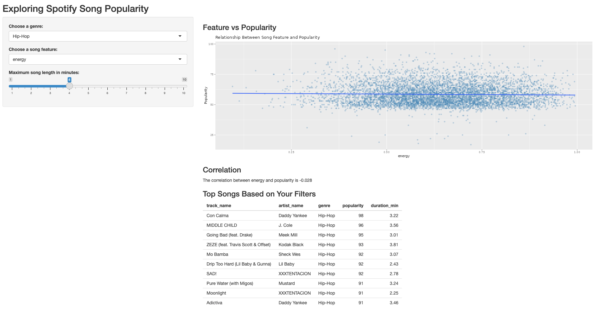

# Spotify Song Popularity Explorer

An interactive R Shiny application for exploring relationships between Spotify song popularity and audio features.

## Overview

This project explores how different audio characteristics relate to song popularity. The application allows users to interact with Spotify song data, filter songs, visualize relationships between variables, examine correlations, and view ranked song results.

## Features

- Explore relationships between popularity and audio features
- Filter songs dynamically based on selected criteria
- Generate interactive data visualizations
- Examine correlations between audio features
- View ranked song results

## Audio Features

The analysis includes variables such as:

- Danceability
- Energy
- Acousticness
- Loudness
- Tempo
- Duration

## Tools & Technologies

- R
- Shiny
- tidyverse
- ggplot2

## Preview

## Dataset

This project uses the SpotifyFeatures.csv dataset originally obtained from Kaggle.

## Running the App

1. Clone or download this repository.
2. Install the required R packages.
3. Open `app.R` in RStudio or Posit Cloud.
4. Run the Shiny application.
